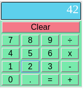

# Fork of Elm Tutorial 6 by Tensor Programming

This is just my fixes to update the code for elm 0.19

# A simple Calculator made with Elm by Tensor Programming

## Run `elm package install` before running `elm reactor` or `elm
   make` so that this app will actually be able to build.

## To build the app, use `elm-make todo.elm`, otherwise you can use
   `elm reactor` to run the app on a dynamic server.

### You can also dynamically build the application by copy and pasting
    the code into the [elm try online
    app](http://elm-lang.org/try). (make sure to remove the first line
    of code first).

### Check out the Youtube Tutorial for this specific elm
    Program. [video](https://youtu.be/Bi4UwT5EI_A) Here is our
    [Youtube
    Channel](https://www.youtube.com/channel/UCYqCZOwHbnPwyjawKfE21wg)
    Subscribe for more content.

### Check out our blog at
    [tensor-programming.com](http://tensor-programming.com/).

### Our [Twitter](https://twitter.com/TensorProgram) and our
    [facebook](https://www.facebook.com/Tensor-Programming-1197847143611799/).
